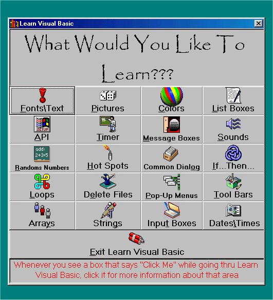

<div align="center">

## \_\_\*\*  Learn Anything About VB  \*\*\_\_


</div>

### Description

Learn anything you want about Visual Basic.
 
### More Info
 


<span>             |<span>
---                |---
**Submitted On**   |2001-09-02 23:10:04
**By**             |[ZEO](https://github.com/Planet-Source-Code/PSCIndex/blob/master/ByAuthor/zeo.md)
**Level**          |Beginner
**User Rating**    |4.7 (1677 globes from 357 users)
**Compatibility**  |VB 6\.0
**Category**       |[Files/ File Controls/ Input/ Output](https://github.com/Planet-Source-Code/PSCIndex/blob/master/ByCategory/files-file-controls-input-output__1-3.md)
**World**          |[Visual Basic](https://github.com/Planet-Source-Code/PSCIndex/blob/master/ByWorld/visual-basic.md)
**Archive File**   |[\_\_\_\_  Lear25805922001\.zip](https://github.com/Planet-Source-Code/zeo-learn-anything-about-vb__1-26899/archive/master.zip)

### API Declarations

```
In the code
*************************************************
*************************************************
Please vote, You know it helped you when you downloaded it
**************************************************************************************************
```


